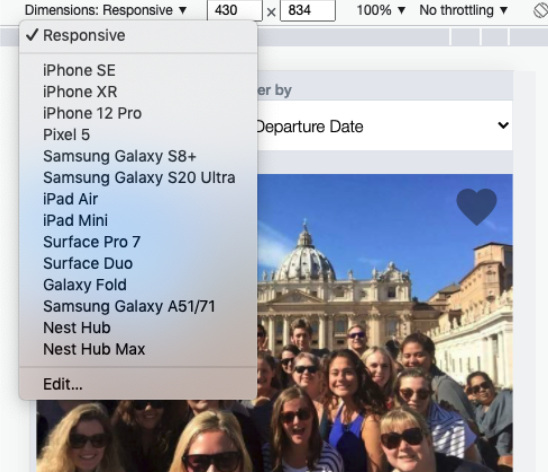
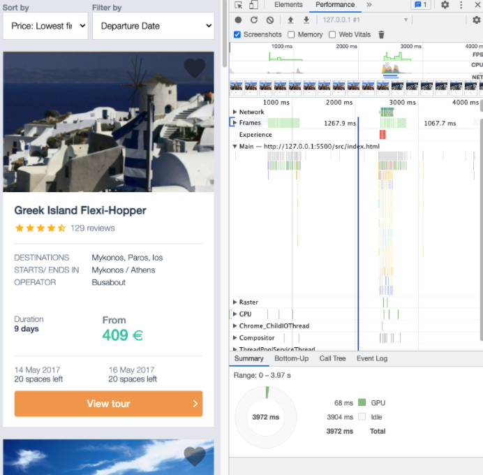
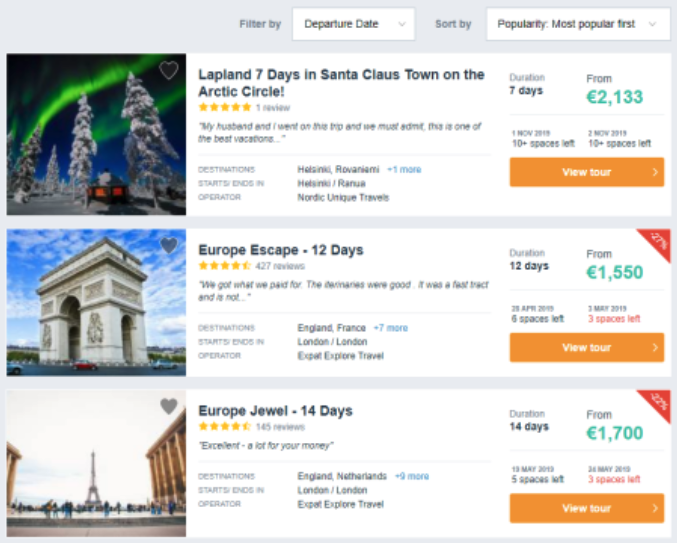
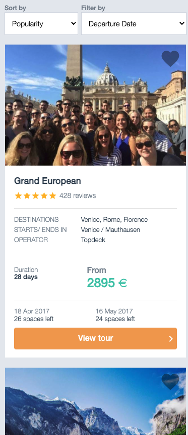
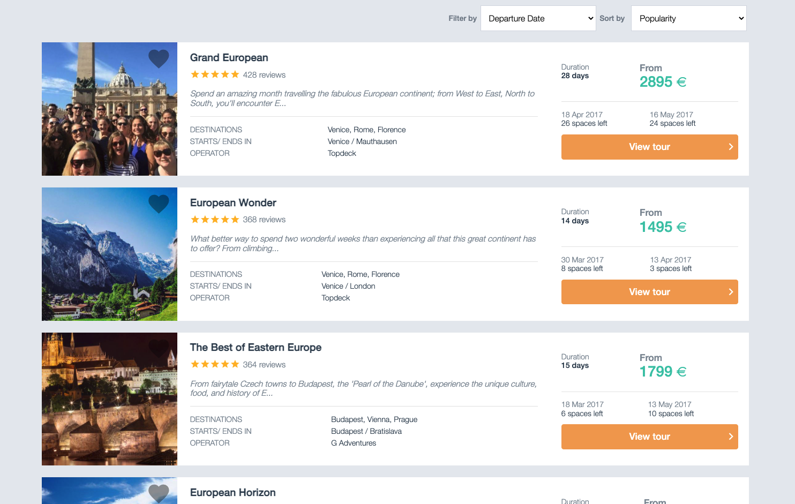
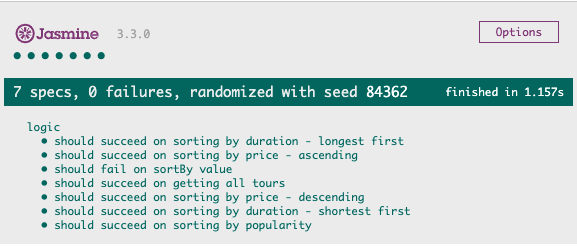

## TourRadar Frontend Engineer Test Case

### Context

To support the travelling needs of our users we have around 35,000 tours live on our website exposed through various page types, such as a Tour Detail Page (TDP) or Search Engine Results Pages (SERPs). For this test case you will focus on a sample SERP page that lists our tours for Europe, which is our highest traffic page. Therefore the page is highly optimised to bring the best experience to our users. This is made possible by taking various aspects into consideration during the development process on a day to day basis.

### Questions we ask you to answer:

### How would you ensure that the page is fully responsive and developed with mobile-first in mind?

**Check the responsiveness of a web page**

First of all, you must pay attention to breakpoints. Normally, you must keep in mind the most important breakpoints for your business goal devices. For example, you can define the typical breakpoints (600px, 900px, 1200px and 1536px) and adjust your content depending on the device screen size. You can even define your own custom breakpoints to give support to any device size screen.

Also,there are a lot of tools outside to check the performance with different breakpoints:

-   [ScreenFly](http://quirktools.com/screenfly/)
-   [Responsinator](https://www.responsinator.com/)
-   [isResponsive](http://www.isresponsive.com/)
-   Browser Tools to inspect breakpoints: it is the most common tool to see how your page performs at different breakpoints and with different devices.

**Develop with mobile first**

To develop a web page with mobile-first technique, you must start building the elements for the smallest breakpoint and from there, adapt the content for bigger breakpoints using media queries.

For example, for this use case I’m using only one breakpoint (900px) to adjust content with media queries.

### What sort of optimizations would you suggest for better UI/UX? Are there any tools/metrics that can help to achieve and/or measure these goals?

There are a lot of factors to improve both User Interface and User Experience. For example, the quality of the content or how easy it is to find what you are trying to do, are key factors. You must keep your users in mind and show the content in an easy way to read and fast to navigate.

-   From a UI perspective, you must design every component in an elegant way and coherent with the business corporate image

-   From a UX perspective, the page performance plays an important rol. There are several tools and techniques to test the performance of a page and you must optimize the size of any local resource and always minimize them on production servers. To provide the fastest delivery you must use a CDN to serve resources and images. Also, it’s highly recommended to try to maintain the load times as shortener as you can.

In my experience as a Digital Marketing Consultant I realized Google Analytics is one of the best tools to gather a lot of useful reports to improve UX/UX. Some of this reports and metrics are:

-   Bounce rate on landing page segmented by device or browser
-   Create alerts to monitor changes on important pages like cart funnels
-   Conversion rate on funnels
-   Internal Site search report
-   Improve the most visited pages if they are bellow site average bounce rate

Also, there are great tools to mention, easy to install (normally a script that can be implemented in Google Tag Manager) and fast to get periodic reports. Some of them are:

-   [Optimizely](https://www.optimizely.com/): you can create A/B testing to check and implement improvements continuously

-   [Hotjar](https://www.hotjar.com/): hotjar allows you to get real recordings from your users and understand much better possible issues to improve

-   [Google Search Console](https://search.google.com/search-console/about): this tool can be really useful because you can get recommendations about how Google sees and crawls your site.

Again, one of the most useful tools you can use during your development process is the browser inspector. For example, in Google Chrome you have several tabs or sections inside the Chrome inspector to maintain UX. To mention one tab:

-   Performance tab: allows you to record user flows to analyze loading page time and other relevant performance information related to each page accessed during the user interaction

Finally, another useful technique to keep improving UX/UI is to implement on-site surveys with the goal to have a better understanding about what your users think about your website.

### How would you make sure that the page works as expected on all supported browsers/devices?

I would start from the beginning of the development process with mobile-first in mind. Also, you can install several browsers on your own computer or create a separate computer with virtualizations to emulate the behavior of different OS and Browser versions.

Also, again there are a lot of tools to check the cross-browser compatibility like [BrowserStack](https://www.browserstack.com/) or [CrossBrowserTesting](https://crossbrowsertesting.com/).

Another tool you can use during your development process to check if a CSS rule is widely supported is [CanIUse](https://caniuse.com/)

### What criteria would you consider for choosing the tech stack for this test case?

I tried to use the suggested tech stack for this case except for Zepto.js (because I have no experience with it). When you choose a tech stack for a website like tourradar you should use something widely browser and device supported and with a bundle size (like Zepto.js has).

Other important factors are the UX/UI and SEO factors (for example, React is not good in SEO terms because it is a Single Page Application which Google has some problems with crawling it properly).

In summary, small, fast and widely supported are the key factors choosing the best tech stack to give a great user experience.

### Things we ask you to implement

Alongside a responsive website that looks like the screenshots below, your proposed solution should at least implement the following features:

-   Fetch provided data from https://mocki.io/v1/11356aa2-6371-41d4-9d49-77a5e9e9924f
-   Sort by lowest and highest price
-   Sort by longest and shortest tour
-   Filter by departure month using departure date dropdown

**Screenshots**

-   From the smallest supported screen

### Things you should consider

-   You must NOT use any big JS frameworks/library (React, Vue, AngularJS, Bootstrap and etc.); using a small library/module (ZeptoJS, jQuery, Moment.js and etc.) for a specific task is perfectly fine.

-   You must not use any CSS library (like Bootstrap); using a CSS Preprocessors like SCSS or LESS is perfectly fine.

-   Your attempted solution should support IE 11+, Edge 12+, FF 28+, Chrome 29+, Safari 9.0+ versions.

PS: Is there something ambiguous in the test case? Some of the ambiguity has been intentionally left in there to give room to your creativity.

---

# [Live Site](https://tourradar-nicopixel.netlify.app/)

### Run the project in localhost

To avoid any CORS error, loading the local `tour.html` file, you must to run a local server (like [Live Server](https://marketplace.visualstudio.com/items?itemName=ritwickdey.LiveServer))

## Testing

The Jasmine testing framework has been implemented in local with some tests against the logic layer.

